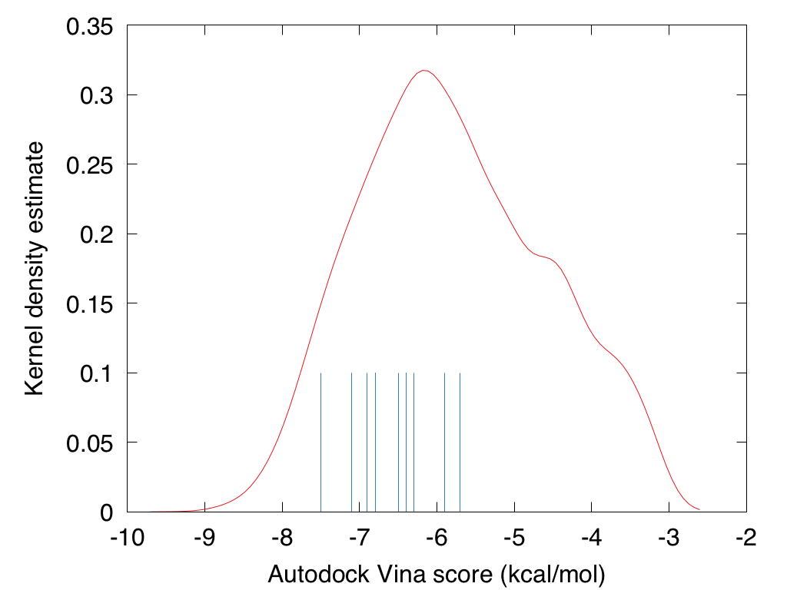

# 0010_JAR-KUA-672_dock

Docking the JAR-KUA-672 submission of Jarryl D'Oyley / Kuano Ltd.

Their description:
"Design Rationale:
Our main goal was the discovery of new inhibitors of M-pro using machine learning.  We started with the M-pro crystallography dataset and literature binding affinity dataset,  which was carefully curated based on removing duplicates, selecting highest quality data sources, removing salts, heavy atoms etc. We used this dataset to train a deep-learning classification model based on a graph convolutional architecture. Selecting a large enough number of negative data points to train the model on was crucial to enable effective screening, as otherwise false positives end up dominating the output and destroy any meaningful chance of selecting binders. Team members working on the submission have extensive experience in getting these criteria right. Fortunately the dataset was diverse enough to enable an efficient virtual screening process, and form prior a hit rate as high as 5% would not be an unreasonable expectation. Virtual screening itself was performed on pre-curated subsets of the REAL diverse dataset using this model as a metric. In addition to this we incorporated a number of selection criteria in post processing, priority was synthesisability but also included novelty and stability.
"

## Docking results

See `.pdbqt` files for docking results; view these in combination with the
prepared protease in the 0001 directory. 

Comparing these scores to the total distribution of ~100'000 docked GB-GA fused
fragments, these all dock better than the median fragment combination. 

