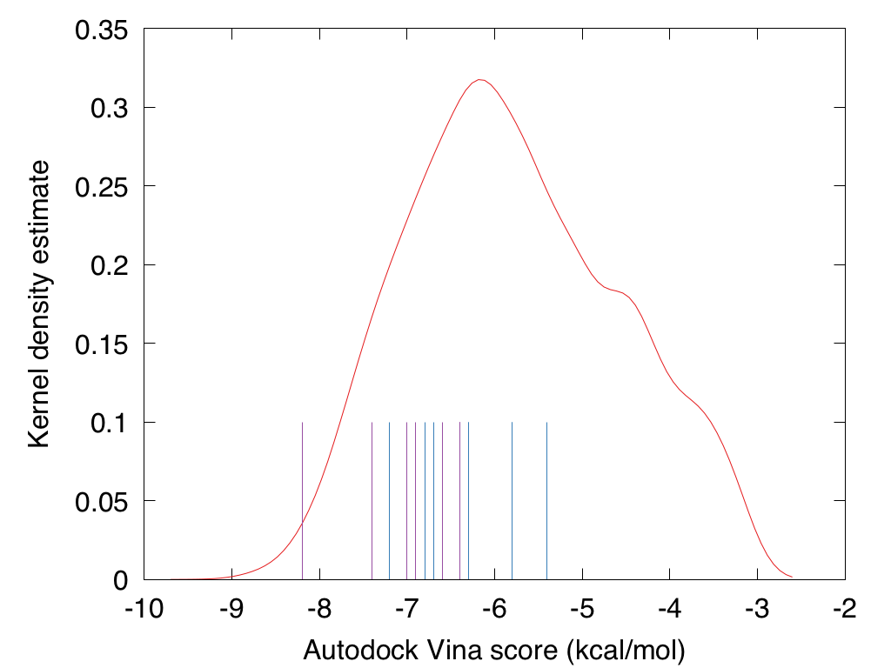

# 0011_JON-UIO-f97_dock

Docking of Jonas Verhellen's f97 and cc9 Covid moonshot structures.

## cc9 rationale

"These designs are based on a generative machine learning model trained on very
broad collection of known anti-viral compounds (HIV-1 Protease inhibitors,
Ebola and Herpes antivirals, ...) and a hand curated selection of related
molecules. The set of molecules generated by this model are then scored on
chemical similarity to the relevant conformers of Umifenovir (in Covid-19
trials as a single agent), Vonoprazan (highest scoring compound in the recent
FOLDING@HOME docking run), and Galidesivir (known for broad-spectrum antiviral
activity). The resulting high-scoring molecules were filtered (softly) on
a series of AMDE and toxicity conditions, including Veber, Egan and Muegge
violations. Most molecules presented here are P-glycoprotein substrates and
have a high GI absorption, and all have a favorable bioavailability score. The
final selection of molecules was decided on by hand based on a range of factors
including synthetic accessibility (ASKCOS), toxicity (SwissADME) and some
diversity measures."

## f97 rationale

"... The set of molecules generated by this model are then scored on chemical
similarity to the COVID-19 / SARS-CoV-2 protease transition state analogue
inhibitor template generated by the Quantum Corona project. The resulting
high-scoring molecules were filtered on a series of AMDE and toxicity
conditions, including Veber, Egan and Muegge violations. All molecules
presented here are P-glycoprotein substrates, have a high GI absorption and
have a favorable bioavailability score. ..."

## Docking

See `.pdbqt` files for docking results; view these in combination with the
prepared protease in the 0001 directory.

Comparing these scores to the total distribution of ~100'000 docked GB-GA fused
fragments, these all dock better than the median fragment combination.

